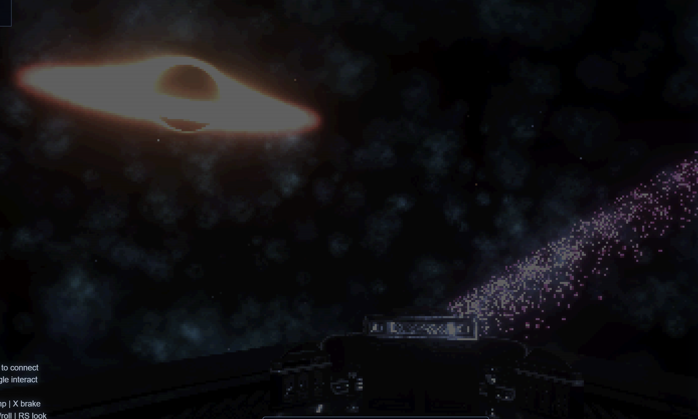

# Deep Space VR

Deep Space VR is a no-build Three.js space exploration prototype built for desktop and PCVR. It combines a seeded procedural universe, a walkable ship interior, inertial 6-DOF flight, hyperdrive-scale traversal, and a custom WebXR post-processing path that preserves the project's retro deep-space visual identity in VR.



## Highlights

- Browser-first ES module app with no bundler or install step.
- Seeded procedural universe with stars, galaxies, nebulae, black holes, pulsars, anomalies, POI markers, and live regeneration controls.
- Walkable ship interior with ship-local movement, piloting, and tethered EVA transitions.
- Autonomous ship simulation with inertia, gravity attractors, dampeners, airbrake, boost, and hyperdrive.
- Desktop post-FX stack plus a custom WebXR render path for bloom, retro pixel treatment, scanlines, color depth, and speed-scaled warp.
- Hyperdrive-responsive star-field aberration and Doppler/beaming, tunable from the F2 `Relativistic Stars` group.
- DualSense / standard gamepad support, WebXR controller support, and runtime debug hooks.
- Validated first RPG loop at Port Meridian: cockpit comms, a deterministic two-branch mission, persistent faction reputation, world flags, and conversation outcomes.
- Live tuning panels: `F2` for post-FX, comfort, XR, and ship tuning, and `F10` for universe generation, presets, import/export, and regeneration.

## Run

This project is served as static files. From the repo root:

```powershell
python -m http.server 5177
```

Then open [http://localhost:5177/](http://localhost:5177/).

## RPG regression tests

Phase 11 includes a dependency-free Node test suite for state creation, reset,
both mission branches, decline, persistence recovery, invalid IDs, and the save
migration boundary:

```powershell
node --experimental-default-type=module --test tests/rpg/rpg-runtime.test.mjs
```

## Custom Radio & Music Transceiver

The walkable ship interior features a diegetic radio transceiver console (RX-90) located in the walkway corridor. In addition to default static channels and celestial signals, players can load their own music playlists.

### Adding Custom Music Stations:
1. Create a subdirectory under `assets/audio/custom_radios/` (e.g. `assets/audio/custom_radios/RetroWave/`).
2. Drop your `.mp3` or `.wav` music tracks inside that subdirectory.
3. Run the manifest generator from the project root:
   ```powershell
   node sync-music.js
   ```
4. Boot the game. The custom directories will be loaded dynamically, sorted, and mapped to unique, deterministic FM frequencies (between 88.0 MHz and 108.0 MHz) on the receiver dial.

## Voice Service

The Phase 09 voice assistant service lives in [services/voice-ai/README.md](/D:/Documents/PROJECTS/DEEP_SPACE_VR/services/voice-ai/README.md).

Quick start from `services/voice-ai`:

```powershell
docker compose up --build
```

Then open [http://localhost:8000/dashboard](http://localhost:8000/dashboard).

Notes:

- There is no `package.json` because Three.js is loaded from a CDN import map in `index.html`.
- First load can take a few seconds because `ship.glb` is large and streams in asynchronously.
- A modern Chromium browser is the safest choice for desktop, Gamepad API, and WebXR support.

## Controls

### On foot and EVA

| Input | Action |
| --- | --- |
| Click canvas | Capture mouse |
| Mouse | Look |
| `W` / `A` / `S` / `D` | Walk / strafe or EVA float |
| `Shift` | Run on foot |
| `R` / `F` | EVA up / down |
| `C` | Contextual interact: take controls, open cockpit comms, leave controls, exit airlock, re-enter ship |
| `T` | Teleport/toggle inside-outside EVA for testing |
| `V` | Return to the first-person player camera |

### Piloting

| Input | Action |
| --- | --- |
| `C` | Take / leave ship controls |
| `W` / `S` | Thrust forward / reverse |
| `A` / `D` | Strafe left / right |
| `R` / `F` | Lift up / down |
| Arrow keys | Pitch / yaw |
| `Q` / `E` | Roll |
| `Shift` | Boost |
| `Z` | Toggle dampeners |
| `X` | Airbrake |
| `Space` | Toggle hyperdrive |

### Debug and panels

| Input | Action |
| --- | --- |
| `1` | Exterior debug camera |
| `2` | Interior debug camera |
| `F2` | Post-FX / comfort / XR / ship panel |
| `F10` | Universe panel |
| `F3` | Toggle debug markers |
| `F4` | Toggle retro effect |
| `F6` | Toggle ASCII effect |
| `F7` | Toggle halftone effect |
| `P` | Replay ship startup animation |
| `L` | Toggle ship animation loop |
| `H` | Toggle VR HUD |

### First RPG mission

The first playable RPG slice is `A Clean Copy` in the authored Port Meridian
system:

1. Use the cockpit navigation computer to lock `Port Meridian [RPG]`.
2. Enter the system and walk to the cockpit comms station.
3. Press `C` to contact Harbormaster Vale.
4. Ask for work, accept the route packet, then route it to either the
   Commonwealth or the Index.
5. Reopen comms after resolving the mission to see the saved branch-specific
   response.

The mission result is saved automatically in browser `localStorage`. To reset
only RPG progress without clearing other site data:

```js
window.__deepSpaceDebug.rpg.reset();
```

### Gamepad and VR

- DualSense and standard gamepads are supported on desktop and in VR.
- In VR, XR controllers are used when no gamepad is connected.
- The project targets PCVR and includes a custom WebXR post-FX route validated for Quest 3 streaming according to [docs/phase-06-xr-post-fx-pipeline.md](docs/phase-06-xr-post-fx-pipeline.md).

## Project structure

```text
assets/
  config/          Runtime JSON overrides
  ship/            Ship manifest / design contract
docs/              Phase notes, specs, and design references
src/
  app/             App orchestration and lifecycle
  config/          Default config and presets
  input/           Gamepad and WebXR input adapters
  player/          Walking, piloting, EVA, and camera rig
  postprocessing/  Custom shaders
  rendering/       Desktop and XR render pipelines, panels, HUD helpers
  rpg/             RPG state, persistence, registries, contacts, missions, and comms runtime
  ship/            Ship entity, physics, controls, model loading, interior
  space/           Procedural universe facade, gravity, and landmarks
  ui/              Diegetic HUD and navigation markers
  xr/              WebXR session and visual FX glue
```

## Configuration and debugging

- Optional startup overrides are loaded from [assets/config/post_processing.json](assets/config/post_processing.json) and [assets/config/universe.json](assets/config/universe.json).
- Runtime presets live in `src/config/`.
- The app exposes `window.__deepSpaceApp` and `window.__deepSpaceDebug` for inspection and scripted validation.

Examples:

```js
window.__deepSpaceDebug.getRenderPipelineState();
window.__deepSpaceDebug.getUniverseState();
window.__deepSpaceDebug.toggleHyperdrive();
window.__deepSpaceDebug.applyUniversePreset('dense_cluster');
window.__deepSpaceDebug.rpg.adjustReputation('commonwealth', 0.25, 'manual-test');
window.__deepSpaceDebug.rpg.getCommsState();
window.__deepSpaceDebug.rpg.getMission('port_meridian_route_packet');
```

The Phase 11A-E implementation and verification checklist are documented in
[docs/phase-11-rpg-roadmap.md](docs/phase-11-rpg-roadmap.md).

## Documentation map

- [docs/project-foundation.md](docs/project-foundation.md) - project conventions and source of truth
- [docs/phase-02-ship-design.md](docs/phase-02-ship-design.md) - ship model and hull integration
- [docs/phase-03-ship-physics.md](docs/phase-03-ship-physics.md) - 6-DOF flight and gravity
- [docs/phase-04-ship-interior.md](docs/phase-04-ship-interior.md) - interior walking, piloting, EVA
- [docs/phase-05-vr-comfort.md](docs/phase-05-vr-comfort.md) - WebXR layer and comfort model
- [docs/phase-06-xr-post-fx-pipeline.md](docs/phase-06-xr-post-fx-pipeline.md) - custom XR post-processing path
- [docs/phase-07-procedural-universe.md](docs/phase-07-procedural-universe.md) - procedural universe architecture
- [docs/phase-08-ship-speed-and-hyperdrive.md](docs/phase-08-ship-speed-and-hyperdrive.md) - speed regime and hyperdrive design
- [docs/phase-11-rpg-roadmap.md](docs/phase-11-rpg-roadmap.md) - RPG implementation roadmap and first comms mission slice
- [docs/phase-12-radio-transceiver.md](docs/phase-12-radio-transceiver.md) - radio transceiver system, custom music folders, and cosmic beacons

## Current caveats

- The imported ship mesh is heavy for VR and may need a decimated or LOD variant for sustained headset performance.
- The interior collision model is an abstract ship-local blockout, not full collision against the authored GLB interior.
- Untethered world-frame EVA, full physical hazards, and a 3D radar/map are still future work.
