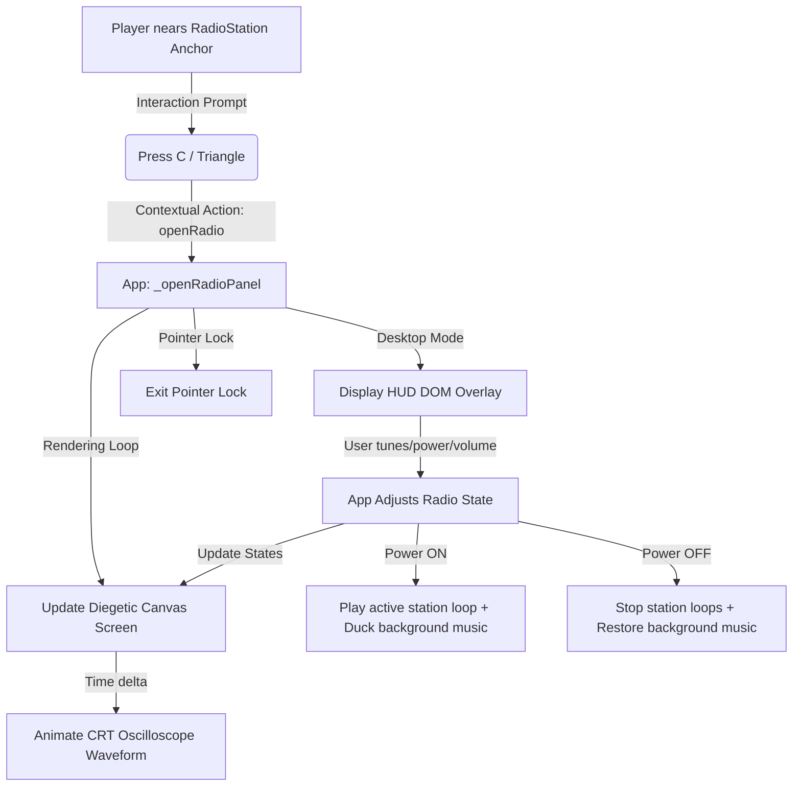

# Phase 12: Radio & Music Transceiver System

This document outlines the architecture, implementation, and future roadmap of the Ship's Radio Transceiver system. The feature is split into three main pillars:
1. **Pillar 1: Diegetic Transceiver Console & CRT UI** (Implemented)
2. **Pillar 2: Custom Local Stations & Directory Drag-Drop / Manifest Loader** (Future)
3. **Pillar 3: Celestial Signal Broadcasts & Proximity Tuning** (Future)

---

## Pillar 1: Transceiver Console & CRT UI (Completed)

Pillar 1 establishes the physical anchor, input state machine, and diegetic/DOM interfaces for interacting with the radio.

### Architecture Flow



### Key Components

- **`src/ship/ShipInterior.js`**: Registers the physical `'radioStation'` anchor point in the walkway corridor (`zone: 'circulation'`, `position: [-1.3, 0.95, 0.0]`) facing the walk path (`forward: [1, 0, 0]`).
- **`src/player/PlayerController.js`**: Tracks proximity to the radio station console. Returns the contextual action `openRadio` and shows the prompt: `"Press C / Triangle - open radio console"`.
- **`src/ui/DiegeticRadioPanel.js`**: Handles drawing onto the `CanvasTexture` mounted on the console plane:
  - Retro Amber monochrome theme (`#ff9c00`).
  - Digital digital readouts of frequency (e.g. `95.4 MHz`) and station name.
  - Interactive volume indicator and dial band markings (`88 - 108 MHz`).
  - Animated **Oscilloscope Waveform**: Displays a flat line when powered off, white noise/static when untuned or playing static, and a scrolling multi-frequency sine wave when tuned to a clean music broadcast.
- **`src/app/App.js`**: Manages the transceiver state, click listener callbacks, keyboard navigation shortcuts, HUD overlay construction, and updates the canvas texture on each tick.
- **`src/audio/AudioDirector.js`**: Coordinates with `App.js` to duck the ambient space soundtrack (`musicAmbient`) to zero when the radio is powered on.

---

## Pillar 2: Custom Local Stations (Blueprint)

Pillar 2 will allow users to drop MP3/WAV files into subdirectories under a new directory in the codebase, which will automatically map to radio stations in-game.

### Directory Structure

```text
assets/audio/custom_radios/
  ├─ RetroWave/
  │   ├─ digital_horizon.mp3
  │   └─ neon_drift.mp3
  └─ DeepSpaceLofi/
      ├─ nebula_chords.mp3
      └─ stardust.mp3
```

### Discovery & Loading Mechanism

Since browser-side JavaScript running via standard file protocols cannot natively list directory contents due to sandbox security constraints, 

#### Build-Time Manifest Generator (Recommended for standalone builds)
1. **Manifest File**: Define a static manifest JSON file (e.g. `assets/audio/custom_radios/manifest.json`) loaded on startup.
2. **Synchronization Script**: Author a small script `sync_music.py` or Node script `sync-music.js` that scans directories and automatically rebuilds the JSON file:
   ```javascript
   // sync-music.js
   const fs = require('fs');
   const path = require('path');
   const rootDir = './assets/audio/custom_radios';
   const stations = fs.readdirSync(rootDir)
       .filter(file => fs.statSync(path.join(rootDir, file)).isDirectory())
       .map(dir => ({
           name: dir.replace(/_/g, ' '),
           folder: dir,
           tracks: fs.readdirSync(path.join(rootDir, dir))
               .filter(file => file.endsWith('.mp3') || file.endsWith('.wav'))
       }));
   fs.writeFileSync(path.join(rootDir, 'manifest.json'), JSON.stringify(stations, null, 2));
   ```
3. **App Integration**:
   - App fetches `manifest.json` on boot.
   - For each custom station, map a random frequency in the FM band.
   - Create a playlist manager class `PlaylistPlayer` to sequence tracks sequentially or randomly.


### Playlist Sequence Logic
To play a custom station:
- Decode the audio files into buffers.
- Create an `AudioBufferSourceNode` for the current track.
- Connect the source node to the `music` bus.
- Bind to the `onended` event callback of the source node to trigger playback of the next track:
  ```javascript
  sourceNode.onended = () => {
      this.playNextTrack(station);
  };
  ```

---

## Pillar 3: Proximity Signal Transmissions (Blueprint)

Pillar 3 will expand the radio transceiver into a scanning scanner capable of picking up distress beacons, cosmic pulses, and celestial broadcasts when located near stellar POIs.

### Proximity Modulation Architecture

```text
       Celestial Object (e.g. Pulsar)
           [ Emits 101.2 MHz Signal ]
                      o
                     / \
                    /   \
                   /     \
                  /       \
  Ship --------->*         * (Signal Edge)
(Tuned to 101.2 MHz)
- Gain scales up: 1.0 - (distance / maxRange)
- Oscilloscope: Noisy Static -> Clean Sine Wave
```

### Implementation Blueprint

1. **Signal Registry**: Register frequencies for celestial targets in the universe configuration:
   ```javascript
   export const CELESTIAL_SIGNALS = {
       pulsar: { frequency: '101.2 MHz', loopId: 'signal2', maxRange: 15000, name: 'Pulsar Rotation Beacon' },
       blackhole: { frequency: '87.9 MHz', loopId: 'blackHoleAccretion', maxRange: 8000, name: 'Gravitational Accretion Hum' },
       anomaly: { frequency: '93.2 MHz', loopId: 'longSignal', maxRange: 12000, name: 'Tachyon Emission Pulse' }
   };
   ```

2. **Distance & Gain Evaluation**:
   - In the `_tick` loop, query the active celestial landmarks from `this.environment.getPOIs()`.
   - Calculate distance `d` to the nearest signal-emitting POI.
   - If the radio is ON and tuned to that POI's frequency:
     - Compute the normalized signal strength: `s = clamp(1.0 - d / maxRange, 0.0, 1.0)`.
     - Blend static noise and signal sound:
       ```javascript
       const signalGain = s * radioVolume * baseGain;
       const staticGain = (1.0 - s) * radioVolume * staticBaseGain;
       audioEngine.setLoopGain(poiSignal.loopId, signalGain, 0.1);
       audioEngine.setLoopGain('spaceBedB', staticGain, 0.1); // cosmic noise static
       ```

3. **CRT Display Signal Feedback**:
   - Render a signal strength meter on the screen: `SIGNAL: [|||||.....] -72 dBm`.
   - Modulate the oscilloscope drawing based on signal strength `s`:
     - If `s === 0`, draw pure high-frequency white noise static.
     - If `s === 1`, draw a clean smooth sine wave.
     - For intermediate values `0 < s < 1`, linearly interpolate the vertical offsets between the noise and the sine wave to visually represent a signal locking in out of the noise.
